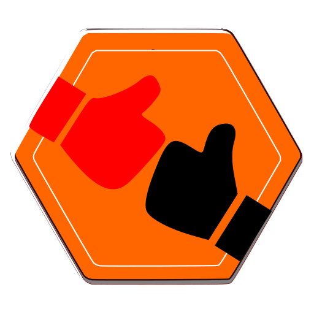

# Dribdat

**An open source hackathon management application that playfully assists your team in crowdsourcing technical designs.** 

🚲 See [Tour de Hack](https://dribdat.cc/tour) for examples, and [User handbook](https://dribdat.cc/usage) for screenshots. 🏔️ There are mirrors on [Codeberg](https://codeberg.org/dribdat/dribdat) and [GitHub](https://github.com/dribdat/dribdat). 🩵 Support us on [OpenCollective](https://opencollective.com/dribdat/updates)

We aim to include people of all backgrounds in using + developing this tool - no matter your age, gender, race, ability, or sexual identity 🏳️‍🌈 Please read our [Code of Conduct](code_of_conduct.md) if you have questions.

# Purpose

Created in light of the [Hacker ethic](https://en.wikipedia.org/wiki/Hacker_ethic), the Zen of Dribdat is (in a nutshell):

- **Commit sustainably**: aggregate results in open, web-friendly data formats for search and archiving.
- **Go live and let live**: efficiently deploy designs, dev envs, docs accessible to your entire team.
- **Co-create in safe spaces**: with content and tools promoting safer conduct and increased privacy.

Designed to bootstrap your [awesome hackathon](https://github.com/dribdat/awesome-hackathon), Dribdat's toolset can be used as a versatile toolbox for civic tech sprints. To get started, [install](#Quickstart) the software. 

Visit the [Hackfinder](https://hackintegration.ch/hackfinder) to find events connected to current research, and join our [Hack:Org:X](https://hackorgx.dribdat.cc) meetings to say 'hi' to the maintainers and fellow hackathon organizers.

For more background and references, see the 📖 [User Handbook](https://docs.dribdat.cc/usage). If you need help or advice in setting up your site, or would like to contribute to the project: please get in touch via 🗣️ [Discussions](https://github.com/orgs/dribdat/discussions).

# Quickstart

The Dribdat project can be deployed to any server capable of serving [Python](https://python.org) applications, and is set up for fast deployment using [Ansible or Docker](https://dribdat.cc/deploy) 🏀 The first user that registers becomes an admin, so don't delay when you make your play on `D}}BD{T` 

If you would like to run this application on any other cloud or local machine, there are instructions in the [Deployment guide](https://docs.dribdat.cc/deploy). Information on contributing and extending the code can be found in the [Contributors guide](https://docs.dribdat.cc/contribute), which includes API documentation, and other details.

See also **[backboard](https://github.com/dribdat/backboard)**: a responsive, modern alternative frontend, and our **[dridbot](https://github.com/dribdat/dridbot)** chat client. Both demonstrate reuse of the dribdat API. If you need support with your deployment, please reach out through [Discussions](https://github.com/orgs/dribdat/discussions). Pull Requests and Issues welcome!

Development Status: 🍌 [Perpetual beta](https://en.wikipedia.org/wiki/Perpetual_beta)

# Credits

This application was based on [cookiecutter-flask](https://github.com/sloria/cookiecutter-flask) by [Steven Loria](https://github.com/sloria), a more modern version of which is [cookiecutter-flask-restful](https://github.com/karec/cookiecutter-flask-restful). [Cookiecutter](https://cookiecutter.readthedocs.io/en/stable/README.html#available-templates) could also be a good bootstrap for your own hackathon projects!

♡ The [Open Data](https://opendata.ch), [Open Networking](https://opennetworkinfrastructure.org/) and [Open Source](https://dinacon.ch) communities in 🇨🇭 Switzerland gave this project initial form and direction through a hundred events. ♥-felt thanks to our [Contributors](https://github.com/dribdat/dribdat/graphs/contributors), and additionally: F. Wieser and M.-C. Gasser at [Swisscom](http://swisscom.com) for support at an early stage of this project, to [Alexandre Cotting](https://github.com/Cotting), [Anthony Ritz](https://github.com/RitzAnthony), [Chris Mutel](https://github.com/cmutel), [Fabien Schwob](https://github.com/jibaku), [Gonzalo Casas](https://github.com/gonzalocasas), [Iliya Tikhonenko](https://github.com/vleugelcomplement), [Janik von Rotz](https://janikvonrotz.ch/), [Jonathan Schnyder](https://github.com/jonHESSO), [Jonathan Sobel](https://github.com/JonathanSOBEL), [Philip Shemella](https://github.com/philshem), [Thomas Amberg](https://github.com/tamberg), [Yusuf Khasbulatov](https://github.com/khashashin) .. and all participants and organizers sending in bugs and requests! You are all awesome `h`a`c`k`e`r`s` ♡

## License

This project is open source under the [MIT License](LICENSE).

The [Contributor Covenant Code of Conduct](code_of_conduct.md) applies to interactions with the maintainers and support community of the project.

Due to the use of the [boto3](https://github.com/boto/boto3/) library for optional S3 upload support, there is a dependency on OpenSSL via awscrt. If you use these features, please note that the product includes cryptographic software written by Eric Young (eay@cryptsoft.com) and Tim Hudson (tjh@cryptsoft.com).
