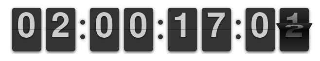
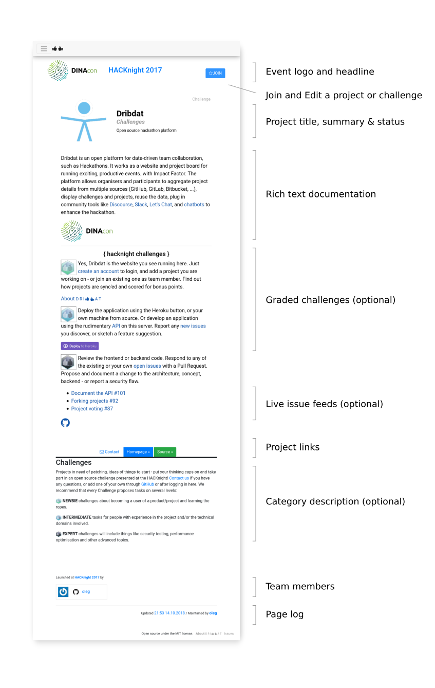
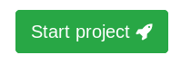

# USAGE

This document explains the basic functions of `} dribdat {`, an open source platform for data-driven team collaboration (such as *[Hackathons](https://hackathon.guide/)*). It is a FAQ covering the basic usage of the application. For more background see [ABOUT](ABOUT.md), and for technical details visit the [README](README.md).

**dribdat** works as a website and project board for running exciting, productive events, and allows organizers and participants to collect their project details in one place, displaying the challenges and projects in Web dashboards, and plugging in community tools such as [Discourse](https://www.discourse.org/), [Slack](http://slack.com), or [Let's Chat](http://sdelements.github.io/lets-chat/) - or using the [remote API](#api) for additional interfaces such as [chatbots](https://github.com/schoolofdata-ch/dridbot) to enhance the hackathon.

We are also working on a new interactive manual at https://github.com/dribdat/handbook

## Quickstart

After you join an event, log in and **Join** a challenge. Or, if it is still possible, start a new challenge or project. You and any of your team members can click the **Join** button at the top of your project page to contribute.

Post your creative **Pitch** using plain text or [Markdown](https://github.com/adam-p/markdown-here/wiki/Markdown-Cheatsheet). Links to videos, documents, a slideshow hosted on [Speaker Deck](https://speakerdeck.com/), and many other [supported sites](https://oembed.com/#section7) will turn into a live preview.

The **Refresh** feature allows you to connect a README from your open source repository on [GitHub](https://github.com), [GitLab](https://gitlab.com) or [Bitbucket](https://bitbucket.org) - or an online document at [Etherpad](http://etherpad.org), [Google Docs](http://docs.google.com) (_Publish to Web_), [Instructables](http://instructables.com), [HackMD/CodiMD](https://hackmd.io) and [DokuWiki](http://make.opendata.ch/wiki/project:home). Use the button on your project page for quickly refreshing changes.

By updating your progress using the **Post** button, you can regularly check in your status and any roadblocks.

## What does it actually look like?

As we are really into making the most of those time constraints, the homepage and dashboard feature a big animated countdown clock:



Here is how a dribdat-powered event looks like in the heat of things:


The picture below explains the various parts of a typical challenge or project page:



This basic documentation makes it easy for fellow participants to understand the challenge - or what you've worked on in response to it - as well as allow the audience, the jury, and so on, to discover your work and respond to it.

## How do you enter content?

Data on projects can be entered into the application directly using text, HTML or [Markdown](https://www.markdowntutorial.com/) formatting. Dribdat features an accessible user-facing frontend (made with Twitter's Bootstrap framework, in case you're wondering) for starting and updating projects, and an administrative backend for the organizing team.

Content may also be aggregated (**Sync**-ed) from an external location by putting in the URL to a public project hosted on one of these supported platforms:

- [GitHub](https://github.com) (README / README.md)
- [GitLab](https://gitlab.com) (README.md)
- [BitBucket](https://bitbucket.org)
- [Etherpad Lite](http://etherpad.org)
- [Google Docs](https://support.google.com/docs/answer/183965?co=GENIE.Platform%3DDesktop&hl=en) (Publish to Web)
- [DokuWiki](http://make.opendata.ch/wiki/project:home)

For more details on entering content, see the [usage steps](#content).

## Why should we use dribdat?

Creative collaborative events are a playground for creative individuals, and events which focus on sustainable solutions need to encourage good documentation and evaluation. Developed and used for hackathon series, dribdat is designed to involve a diverse user base - in particular those of the Swiss NGO [Opendata.ch](https://opendata.ch/events/). This open source platform built by a community for its own needs has developed over time into a unique solution that is used for a wide variety of events, and every contribution helps to assure the future development of this project.

Logged-in users can submit challenges, ideas and projects by linking their document or repository, or entering details directly into a form. Many customizations to the process and content of the event can be made. You can change or customize the [instructions](dribdat/templates/includes/quickstart.md) for new projects as you see fit in the Event administration.

## How do I use this effectively?

Once you've signed up for a challenge, found a team and joined a group channel, you will soon start brainstorming daring and innovative solutions. Use dribdat to keep a notebook, post updates about your team's progress, accelerate your collaboration efforts and get ahead of the game to rock your pitch at the end.

Having a readable, regularly updated overview of what your team is working on is your secret weapon in collaborative projects. Remember to release early, release often, and use the power of evaluation for quick feedback to your experiments. Then rock that stage with your results!

## What are the steps for users?

Here we explain the steps that users typically go through in using dribdat. Feel free to copy and paste and adapt this into your event documentation:

### 1. Sign in

Click **Login** at the top of the page and either use the e-mail and password to register and log in, or for servers that are connected to Slack, look for a button that looks like this:


If you have issues logging into the platform, please contact the organizing team of your event for help.

### 2. Find your team

Every active team should have a public project page on dribdat.

These are sometimes categorized according to the challenge topic they address at the top of the event page, which is a kind of digital map. The button at the far right (&#9776;) switches to a list mode, which can also help you to find your team if there are a lot of challenges. Here is an example from a recent Dribdat event which uses categories:


If your team does not yet have a project, then you may (administrators can disable this) be able to create one with the green **Start project** button (which is called **Announce Challenge** before the event begins) to create a project:



Once you have found your group, open the project page, and tap on the blue **Join** button at the top, which looks like this:


You should then see your name along with any other team members listed underneath. You can also Leave (click the ★ blue star) the project if you joined one by accident.

If you need to make changes or link your name to somewhere on the Internet, click **Profile** in the top of the page.

### 3. Post an update

Once you join a project in step (2), buttons appear at the top of the page allowing you to *Post* and *Edit* updates about your experience.


By clicking the **Post** button, you can give a quick status report of your progress. A dialog box asks you to self-evaluate your team's **Progress**, as well as enter a few words or sentences to describe at which stage you are at in the process. You can find these posts in the project **Log**:


Try to use this regularly to keep tabs on how and your team are spending your precious time at the event. It will help you to learn from the experience and think of improvements for next time.

### 4. Share your results

If you need to make other changes to your project, click the **Edit** button. You will also see other fields there allowing you to set up how your project is presented. There are three basic ways to share your team's efforts: 1) a free form Description, 2) external content via Sync, and 3) external content in a frame with the Project link.

In the large **Description** field you can post notes on your final results, such as a video or slide presentation, summarizing in free form your solution to the challenge. This can be plain text, in HTML or Markdown. If you need to add an image, use a cloud hosting service like Imgur and paste the link in like this: ``

As noted at the top of this guide: if you are using GitHub, Google Docs, a wiki, etc., to write your documentation, you don't need to copy and paste it into dribdat. Use the **Sync** capability to automatically scrape the contents of your README or webpage into your project. Pretty hacky, huh? `;-)`

You can also use the **Project link** to embed documentation you are working on elsewhere into a frame on your project page. This could be a demo of your application, or - in the early phases at least - collaboration tools for your team.

For example, if you are using a wireframing tool and can share it with a public link, add it to the page using the Project link and enable **Embed** mode to have it update automatically as you work on it - like in this screenshot featuring [Draw.io](https://draw.io/):


Shared text documents, a folder full of sketches, datasets, and any other online materials can be showcased in this manner. Put whatever is currently the most actively developed prototype at the top, and list links to any other relevant materials in your description or project updates.

### 5. Keep a beginner's mind

Have you never participated in an event, where you were not quite sure what you can contribute, you do not know anyone yet here, or are just stuck? In the header bar you will find a link to the **Community** - most likely a chat channel or forum - where people are posting questions and support issues.

In the same vein, adding a **Contact** link to your project which points to your team's chat channel or Issues page helps to connect you to (hopefully very constructive) criticism and encouragement from the audience.

Remember: _there is no such thing as a stupid question._


# Further solutions

Dribdat helps us to keep things fun and unpredictable at our events. We love hacking on the platform itself, and would love to hear your feedback.

Here we cover some ways of extending dribdat's functions with additional tools. If you have any other questions or suggestions, please leave them in our [Issues](https://github.com/dribdat/dribdat/issues).

## How is the work evaluated?

At the bottom of the project page (administrators: use the Community Code field) you may find a tool with which visitors to your project can leave a quick public commentary or just an Emoji in response to what they see. Leave your own suggestions and constructive commentary to motivate your fellow participants!

For example, here is how [Disqus](https://disqus.com) was integrated with dribdat at a recent event:


## What about Intellectual Property?

The teams are free to decide for themselves which license conditions apply to their work. However, open access allows for the best evaluation, so we are stipulating a *Creative Commons license by default* which will apply to any project documentation which is not explicitly adherent to a different license or conditions.

We also typically encourage organizers to adopt the [Hack Code of Conduct](https://hackcodeofconduct.org/).

You can add both with this snippet in your event's **Community code**:

```
<div class="codeofconduct">All attendees, sponsors, partners, volunteers and staff at our events are required to agree with the <a href="https://hackcodeofconduct.org/" target="_blank">Hack Code of Conduct</a>. Organisers will enforce this code throughout. We expect cooperation from all participants to ensure a safe environment for everybody.</div>

<br><p><a rel="license" href="http://creativecommons.org/licenses/by/4.0/" target="_blank"></a>The contents of this website, unless otherwise stated, are licensed under a <a rel="license" href="http://creativecommons.org/licenses/by/4.0/" target="_blank">Creative Commons Attribution 4.0 International License</a>.</p>
```

## Show me the back end

The administrative interface shown below allows defining details of the event and managing project data.


Here you can see challenges and projects, with a rating of how completely they are documented. In the `Events` screen there are links to a *Print* view for a summary of all projects on one page, and the ability to *Embed* results into another website. The look and feel of the projects as well as instructions for teams can be customized per-event.

You can pre-configure **Categories** for your site or a specific event, as well as **Roles** in the `Presets` section of the admin. For example, you could define the following Roles:

- 🖍️ Designer
- ⚙️ Enabler
- 💡 Facilitator
- 🛡️ Organizer

## I want to use this elsewhere

Please contact the dribdat maintainers through the [homepage](https://dribdat.cc/), where you can find links to get a free copy of the software - or just ask the organising team at a dribdat-powered event for leads. We will be happy to get you any help you need to get started.

Happy hacking!
