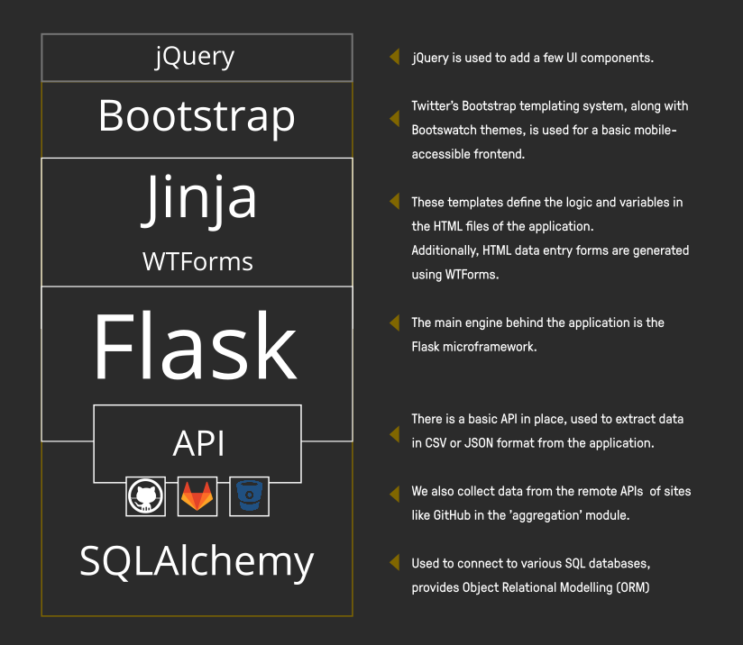

Developer Guide
---

This document contains additional information on contributing to dribdat as a developer. If you are just interested in connecting to dribdat's API, scroll down to the [API overview](#api-guide)

For more background references, see the [README](README.md).

## Software Architecture

This code is originally based on [cookiecutter-flask](https://github.com/cookiecutter-flask/cookiecutter-flask), which has a number of helpful [developer features](https://github.com/cookiecutter-flask/cookiecutter-flask#features). It is a Python 3 project that uses the Flask microframework and SQLAlchemy for data modelling on the backend. A plain JSON API, along with Jinja templates and WTForms, serves data to a frontend based on Bootstrap 3 and jQuery.



## Getting started

Install Python (3.7+), Virtualenv and Pip, or [Poetry](https://python-poetry.org/) to start working with the code.

You may need to install additional libraries (`libffi`) for the [misaka](http://misaka.61924.nl/) package, which depends on [CFFI](https://cffi.readthedocs.io/en/latest/installation.html#platform-specific-instructions), e.g. `sudo dnf install libffi-devel`

Run the following commands from the repository root folder to bootstrap your environment:

```
poetry shell
poetry install
```

Or using plain pip:

```
pip install -r requirements/dev.txt
```

By default in a dev environment, a SQLite database will be created in the root folder (`dev.db`). You can also install and configure your choice of DBMS [supported by SQLAlchemy](http://docs.sqlalchemy.org/en/rel_1_1/dialects/index.html). In production, the `DATABASE_URL` configures connectivity to an SQLAlchemy-compatible database engine. This requires a `DRIBDAT_ENV=prod` configuration.

> **Tip**: Use `.flaskenv` or `.env` to store environment variables for local development. See the [Configuration](#configuration) section for more details.

Run the following to create your local SQLite database tables and perform the initial migration. Note that we avoid using the production `migrations` folder locally due to [Flask-Migrate#61](https://github.com/miguelgrinberg/Flask-Migrate/issues/61):

```
mv migrations migrations_prod
python manage.py db init
python manage.py db migrate
python manage.py db upgrade
```

Install a local copy of frontend resources for offline development using [yarn install](https://yarnpkg.com/en/docs/getting-started). These will be used when `FLASK_ENV=dev`, otherwise a CDN will be used in production.

Finally, run this command (or just `debug.sh`) to start the server:

```
FLASK_DEBUG=1 python manage.py run
```

You will see a welcome screen at http://127.0.0.1:5000 - register your first user account, which will have admin access and let you set up events.

## Coding tips

This section has some advice for developers and operators.

### Shell access

To open the interactive shell, run: `python manage.py shell`. By default, you will have access to the `User` model, as well as Event, Project, Category, Activity.

Using the [Heroku toolchain](https://devcenter.heroku.com/categories/command-line), `heroku run python manage.py shell`, or using [Docker](https://www.docker.com/), `docker-compose run --rm dribdat python manage.py shell`.

### Running Tests

To run all tests, whose source is in the **tests** folder, run: `python manage.py test`

To run just a specific test, specify it by name, e.g. `python manage.py test --name features`

### Migrations

Whenever a database migration needs to be made. Run the following commands:

```
python manage.py db migrate
```

This will generate a new migration script. Then run:

```
python manage.py db upgrade
```

To apply the migration. Watch out for any errors in the process.

For a full migration command reference, run `python manage.py db --help`.


# API Guide

There are a number of API calls that admins can use to easily get to the data in Dribdat in various formats. The full list of calls is shown in the **About** or Search page in a running app. For example, to get basic data on an event:

- `/hackathon.json`
- `/api/event/current/info.json`
- `/api/event/current/projects.json`
- `/api/event/<EVENT ID>/info.json`
- `/api/project/activity.json`
- `/api/<PROJECT ID>/activity.json`

To search all project contents:

- `/api/project/search.json?q=<text_query>`

Use the `limit` query parameter to get more or less than 10 results.

For more details see [api.py](dribdat/public/api.py)

## Write access (beta)

If you would like to use external clients, like the chatbot, to remote control Dribdat you need to set `DRIBDAT_APIKEY`. The (experimental) call used to push data into projects is:

- `/api/project/push.json`
